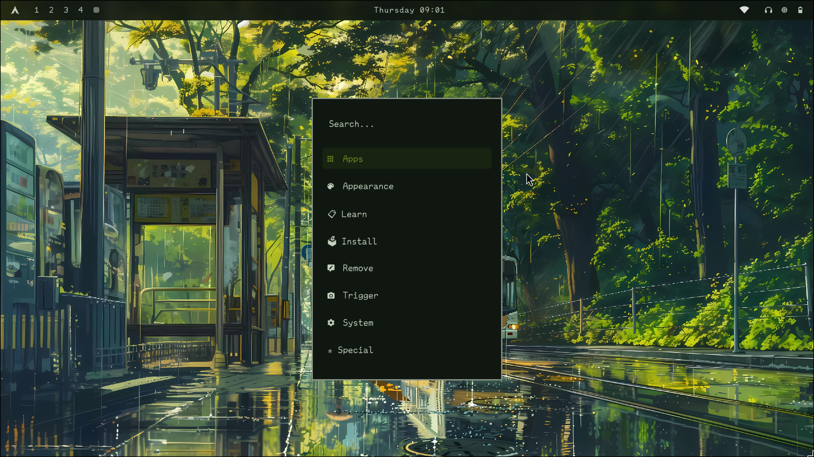
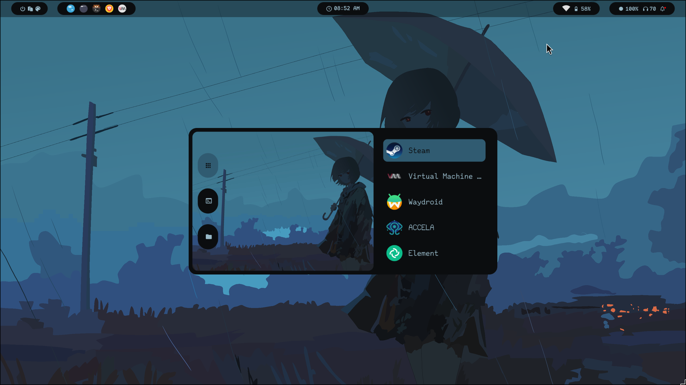
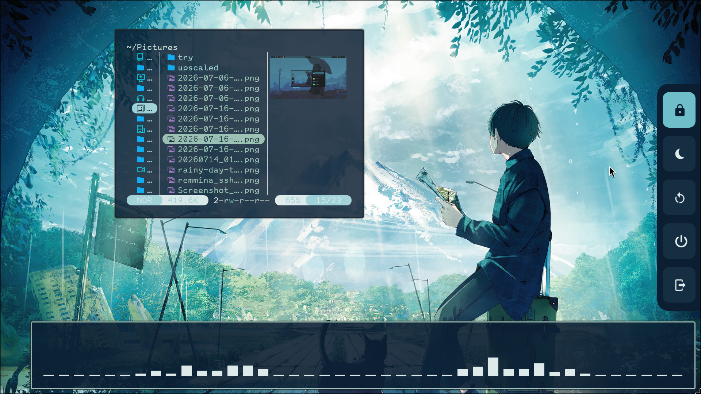
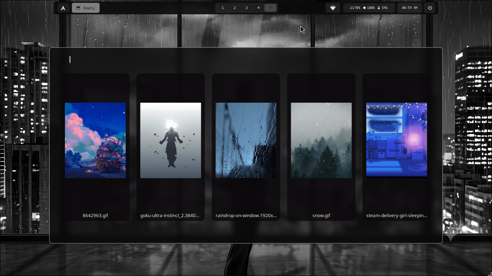

# Zenith 󰞔

**Zenith** is an automated, dynamic, and orchestrating Hyprland system designed for users who want a high-performance desktop that is as functional as it is beautiful. 

Zenith isn't just a collection of config files; it's a **Desktop Orchestration Engine**. With integrated OCR, dynamic color-theming, and a custom Tweak Menu, Zenith turns your OS into a precision tool.

---

## 󰟀 Gallery

| Style 1 | Style 2 | Style 3 |
| :---: | :---: | :---: |
|  |  |  |

| Tweak Menu | Workspace View |
| :---: | :---: |
|  |  |

---

## 󰏖 Core Features

*   **󰍉 Dynamic Theming:** Automatically adapts colors for GTK, Kitty, Rofi, and Waybar based on your wallpaper.
*   **󰈮 OCR Integration:** Instant screen-grab text recognition.
*   **󰞕 Custom Workspace Management:** Seamlessly move windows to special workspaces and retrieve them via an intuitive Rofi menu.
*   **󱁤 Automated Orchestration:** A modular script system that makes personalization easy and fast.
*   **󰔟 Tweak Menu:** Manage Blur, Rounding, Gaps, and Cursor themes on the fly without editing files manually.
*   **󰣇 Built for Arch:** Optimized for performance and stability on Arch Linux.

---

## 󰖟 Installation

Make sure you have `hyprland`, `rofi`, and `waybar` installed. Then run:

```bash
git clone [https://github.com/YOUR_USERNAME/Zenith.git](https://github.com/YOUR_USERNAME/Zenith.git)
cd Zenith
chmod +x install.sh
./install.sh
